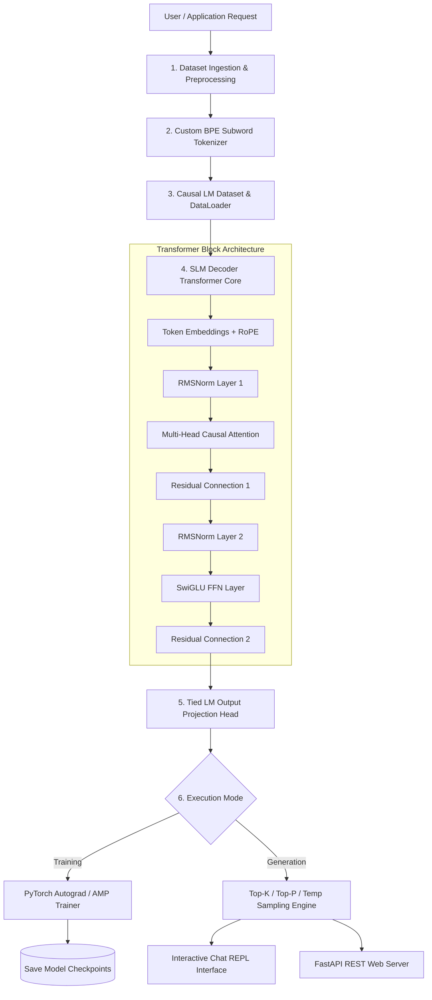

---
language:
- en
license: mit
tags:
- law
- slm
- causal-lm
- pytorch
- transformer
- text-generation
pipeline_tag: text-generation
inference: true
library_name: slm
model_name: LawSLM
---

# Small Language Model (SLM) — Complete Industrial Manual


An industrial-grade, decoder-only Small Language Model (SLM) ecosystem built completely from scratch in pure Python and PyTorch primitive operations.

---

## Table of Contents

1. [Zero External Dependencies Guarantee](#zero-external-dependencies-guarantee)
2. [Model Architecture & Mathematical Specifications](#model-architecture--mathematical-specifications)
3. [System Design & Component Architecture](#system-design--component-architecture)
4. [System Wireframes & UI Interfaces](#system-wireframes--ui-interfaces)
5. [Quickstart Guide](#quickstart-guide)
6. [Dataset Sources & Preparation](#dataset-sources--preparation)
7. [How to Train the Model](#how-to-train-the-model)
8. [How to Use & Chat with the Model](#how-to-use--chat-with-the-model)
9. [REST API Server Integration](#rest-api-server-integration)
10. [Hardware Benchmarking & Testing](#hardware-benchmarking--testing)
11. [Project Directory Hierarchy](#project-directory-hierarchy)
12. [License](#license)

---

## Zero External Dependencies Guarantee

This repository contains **NO reliance** on Hugging Face (`transformers`, `tokenizers`, `datasets`, `accelerate`), pre-built GPT/Llama models, or third-party attention implementations:

- **Byte-Pair Encoding (BPE) Tokenizer**: Learns subword merges, byte/character fallback, special tokens (`<pad>`, `<unk>`, `<s>`, `</s>`, `<mask >`), serialization, and encoding/decoding completely from scratch.
- **Rotary Position Embedding (RoPE)**: Relative rotary position embeddings applied directly to query & key attention states.
- **Root Mean Square Normalization (RMSNorm)**: Numerical scaling layer normalization ($\text{RMSNorm}(x) = \frac{x}{\text{RMS}(x)} \cdot \gamma$).
- **SwiGLU Activation**: Swish Gated Linear Unit Feed-Forward Network ($x \cdot \text{Swish}(W_g x) \cdot (W_v x)$).
- **Scaled Dot-Product & Multi-Head Causal Attention**: Triangular causal masking for autoregressive language modeling.
- **Custom Optimizers**: `CustomAdamW` with decoupled weight decay and `CustomLion`.
- **Learning Rate Schedulers**: Cosine Annealing with Warmup and Linear Warmup.
- **Sampling & Text Generation Engine**: Temperature, Top-K, Top-P (Nucleus), Repetition/Frequency/Presence penalties, and streaming token callbacks.
- **Interactive Chat REPL**: Ask questions and chat directly with your trained model in real-time.
- **FastAPI REST API & CLI**: Complete REST server endpoints and CLI commands.

---

## Model Architecture & Mathematical Specifications

### 1. Model Configurations Summary

| Configuration Profile | Vocabulary Size | Hidden Dim ($d_{\text{model}}$) | Attention Heads | Transformer Layers | Feed-Forward Dim ($d_{\text{ff}}$) | Max Sequence Length | Parameter Count |
| :--- | :--- | :--- | :--- | :--- | :--- | :--- | :--- |
| **Nano SLM** (`configs/nano_config.yaml`) | 2,000 | 128 | 4 | 2 | 512 | 256 | ~0.5M |
| **Standard SLM** (`configs/default_config.yaml`) | 32,000 | 512 | 8 | 8 | 2,048 | 1,024 | ~28M |
| **Medium SLM** (Custom Config) | 32,000 | 1,024 | 16 | 16 | 4,096 | 2,048 | ~140M |

---

### 2. Core Mathematical Layers

#### A. Rotary Position Embeddings (RoPE)
Given key/query projection vectors $x \in \mathbb{R}^{d_{\text{head}}}$, RoPE rotates token pair slices using complex position angle frequencies:
$$\mathbf{R}_{\Theta, m}^{d} \mathbf{x}_{m} = \begin{pmatrix} x_1 \cos m\theta_1 - x_2 \sin m\theta_1 \\ x_1 \sin m\theta_1 + x_2 \cos m\theta_1 \\ \vdots \end{pmatrix}$$
where $\theta_i = 10000^{-2(i-1)/d}$.

#### B. RMSNorm (Root Mean Square Normalization)
Instead of centering by mean, RMSNorm scales vector activations directly by their root-mean-square amplitude:
$$\text{RMSNorm}(\mathbf{x}) = \frac{\mathbf{x}}{\sqrt{\frac{1}{d}\sum_{i=1}^d x_i^2 + \epsilon}} \odot \gamma$$

#### C. SwiGLU Feed-Forward Network
SwiGLU applies Swish gating across parallel linear weight projections ($W_g, W_v, W_o$):
$$\text{SwiGLU}(\mathbf{x}) = \left( \left( \mathbf{x} W_g \right) \cdot \sigma\left( \mathbf{x} W_g \right) \right) \odot \left( \mathbf{x} W_v \right) W_o$$

#### D. Scaled Dot-Product Causal Attention
Autoregressive attention prevents future token leakage using lower-triangular causal masks:
$$\text{Attention}(Q, K, V) = \text{softmax}\left( \frac{Q K^T}{\sqrt{d_k}} + M_{\text{causal}} \right) V$$
where $M_{\text{causal}}[i, j] = 0$ for $i \ge j$ and $-\infty$ for $i < j$.

#### E. Weight Tying
To reduce parameters and improve generalization, token embedding weights $W_{\text{emb}} \in \mathbb{R}^{V \times d}$ are tied directly to the final Causal LM output head projection layer:
$$W_{\text{lm\_head}} = W_{\text{emb}}^T$$

---

## System Design & Component Architecture

### High-Level System Architecture



### Data Pipeline Architecture

```
Raw Documents (.txt / .json / .csv / .pdf)
         │
         ▼
[TextCleaner] normalize_unicode() ➔ strip_tags() ➔ deduplicate()
         │
         ▼
[BPETokenizer] train_on_texts() ➔ learn merge rules ➔ save vocab.json
         │
         ▼
[CausalLMDataset] Token windowing ➔ Shift Targets (Input: x_0..x_T-1, Target: x_1..x_T)
         │
         ▼
[DataLoader] Dynamic Batching & Shuffling ➔ GPU Tensor Tensors
```

---

## System Wireframes & UI Interfaces

### 1. Interactive Chat REPL Terminal Wireframe

```
================================================================================
          SLM INTERACTIVE CHAT REPL (Pure Python Decoder Model)
================================================================================
 Model Config: d_model=512 | n_heads=8 | n_layers=8 | vocab=32000 | device=cuda
 System Mode : Autoregressive Causal Sampling (Temp=0.7, Top-K=40, Top-P=0.9)
================================================================================
 Type your prompt/question below. Type 'exit', 'quit', or 'q' to terminate.
--------------------------------------------------------------------------------

 User > What is the primary function of a Small Language Model?

 SLM  > A Small Language Model (SLM) is a compact transformer network designed 
        for high-efficiency local inference and rapid domain pre-training 
        without needing massive datacenter compute.

--------------------------------------------------------------------------------
 User > Explain Rotary Position Embeddings (RoPE).

 SLM  > RoPE rotates query and key vectors in 2D vector slices by position-
        dependent angles, enabling natural relative position decay.

--------------------------------------------------------------------------------
 User > q
 [Chat Session Terminated. Model memory freed.]
================================================================================
```

---

### 2. REST API Web Server OpenAPI Wireframe

```
┌──────────────────────────────────────────────────────────────────────────────┐
│  FASTAPI REST API DASHBOARD — Small Language Model Service (v1.0.0)          │
│  Base URL: http://localhost:8000                                            │
├──────────────────────────────────────────────────────────────────────────────┤
│  ENDPOINTS:                                                                  │
│  [GET]   /health           ➜ Server & Hardware Status Check                  │
│  [GET]   /info             ➜ Model Architecture & Parameter Metadata         │
│  [POST]  /generate         ➜ Autoregressive Text Generation                  │
│  [POST]  /tokenizer/encode ➜ Tokenize Raw Text into Integer Sequence           │
│  [POST]  /tokenizer/decode ➜ Decode Integer IDs back into String              │
├──────────────────────────────────────────────────────────────────────────────┤
│  SAMPLE POST /generate REQUEST PAYLOAD:                                      │
│  {                                                                           │
│    "prompt": "User: What is Causal Attention?\nSLM:",                        │
│    "max_new_tokens": 128,                                                    │
│    "temperature": 0.7,                                                       │
│    "top_k": 40,                                                              │
│    "top_p": 0.9                                                              │
│  }                                                                           │
└──────────────────────────────────────────────────────────────────────────────┘
```

---

## Quickstart Guide

### Installation

Clone the repository and install in editable mode:

```bash
cd lawslm
pip install -e .
```

Dependencies required: `torch`, `numpy`, `pyyaml`, `fastapi`, `uvicorn`, `pydantic`, `pytest`.

---

## Dataset Sources & Preparation

### 1. Download Open Datasets (Built-in Downloader Script)

You can download open-source training text datasets directly using the included downloader script:

```bash
# Download WikiText-2 (Wikipedia articles)
python scripts/download_sample_dataset.py --name wikitext2

# Download TinyStories (Synthetic clean story corpus)
python scripts/download_sample_dataset.py --name tinystories

# Download TinyShakespeare (Shakespeare corpus)
python scripts/download_sample_dataset.py --name tinyshakespeare
```

### 2. Recommended Open Dataset Sources

| Dataset Name | Best Use Case | Source Link |
| :--- | :--- | :--- |
| **TinyStories** | **Top Choice for SLMs**: Synthetically generated clean stories to teach small parameter models grammar & reasoning fast. | [`roneneldan/TinyStories`](https://huggingface.co/datasets/roneneldan/TinyStories) |
| **WikiText-103 & WikiText-2** | Standard high-quality Wikipedia corpus formatted in clean plain `.txt`. | [Salesforce WikiText](https://blog.salesforceairesearch.com/the-wikitext-long-range-dependency-language-modeling-dataset/) |
| **Project Gutenberg** | Over 70,000 free public domain books (literature, science, history). | [gutenberg.org](https://www.gutenberg.org/) |
| **Legal & Court Datasets** | Free Law Project / CourtListener public court opinions and statutes. | [courtlistener.com](https://www.courtlistener.com/api/bulk-data/) |

### 3. Preprocess & Clean Custom Datasets

Preprocess raw text files (`.txt`, `.json`, `.jsonl`, `.csv`, `.md`) to normalize Unicode, strip HTML tags, split sentences, and deduplicate lines:

```bash
python scripts/preprocess_data.py --input data/wikitext2_train.txt --output data/cleaned_dataset.txt
```

---

## How to Train the Model

### Method A: Command Line Interface (CLI)

To start training with `nano_config.yaml` or `default_config.yaml`:

```bash
python -m slm.cli.main train --config configs/nano_config.yaml --dataset data/cleaned_dataset.txt
```

### Method B: Python Runner Script

Execute the training script directly:

```bash
python scripts/train_run.py
```

### Advanced Training Features
- **Teacher Forcing**: Causal autoregressive target shifting ($y_t = x_{t+1}$).
- **Automatic Mixed Precision (AMP)**: FP16 / BF16 training via PyTorch CUDA autocast.
- **Gradient Accumulation**: Supports large effective batch sizes even on limited GPU memory.
- **Automatic Checkpointing**: Checkpoints are automatically saved to `checkpoints/` (weights, optimizer, scheduler, tokenizer, and random seeds).

---

## How to Use & Chat with the Model

### Method A: Interactive Chat REPL Script

Launch a real-time interactive chat session:

```bash
python scripts/chat_run.py checkpoints/best_model.pt
```

### Method B: CLI Chat Command

Run via the CLI chat command:

```bash
python -m slm.cli.main chat --checkpoint checkpoints/best_model.pt
```

### Single Text Generation Command

To generate text continuation for a single prompt:

```bash
python -m slm.cli.main generate \
  --prompt "The primary goal of language modeling is" \
  --checkpoint checkpoints/best_model.pt \
  --max_tokens 100 \
  --temperature 0.8 \
  --top_k 40 \
  --top_p 0.9
```

---

## REST API Server Integration

Launch the FastAPI production web server:

```bash
uvicorn slm.api.app:app --host 0.0.0.0 --port 8000 --reload
```

Interactive OpenAPI Documentation is available at: `http://localhost:8000/docs`

### Ask Model via `cURL`

```bash
curl -X POST "http://localhost:8000/generate" \
  -H "Content-Type: application/json" \
  -d '{
    "prompt": "User: What is deep learning?\nSLM:",
    "max_new_tokens": 64,
    "temperature": 0.7,
    "top_k": 40,
    "top_p": 0.9
  }'
```

### Ask Model via Python `requests`

```python
import requests

response = requests.post(
    "http://localhost:8000/generate",
    json={
        "prompt": "User: Explain self-attention in simple terms.\nSLM:",
        "max_new_tokens": 100,
        "temperature": 0.7
    }
)

data = response.json()
print("Model Reply:", data["generated_text"])
```

---

## Hardware Benchmarking & Testing

### Benchmark Latency & Token Throughput

Benchmark forward pass latency, token throughput (tokens/sec), and VRAM memory stats:

```bash
python scripts/benchmark_run.py
```

Or via CLI:

```bash
python -m slm.cli.main benchmark --batch_size 4 --seq_len 256 --device auto
```

### Unit Test Suite Execution

Execute PyTest to verify tokenization, causal attention masking, RMSNorm, custom AdamW optimizer, and model forward pass:

```bash
pytest -v tests/
```

---

## Hugging Face Hub Upload & Metadata Guide

### 1. Fixed Metadata & Unsafe File Exclusions
- **YAML Frontmatter Metadata**: Added valid Hugging Face YAML frontmatter to `README.md` and `MODEL_CARD.md` to resolve the *YAML Metadata Warning: empty or missing yaml metadata in repo card*.
- **Unsafe File Scanning**: Added `.gitignore` and uploader rules excluding `node_modules/`, `web/node_modules/`, `dist/`, and binary build artifacts to eliminate security scanner flags.

### 2. Push Code & Model to Hugging Face Hub

Push your model weights, configs, tokenizer, and repo card automatically using [push_to_hf.py](file:///c:/Users/amita/myprojects/lawslm/scripts/push_to_hf.py):

#### Option A: Pass token directly via CLI flag (Recommended)
```bash
python scripts/push_to_hf.py --repo_id Amit123103/Law_model_slm --token hf_YOUR_HF_ACCESS_TOKEN
```

#### Option B: Set environment variable in PowerShell
```powershell
$env:HF_TOKEN="hf_YOUR_HF_ACCESS_TOKEN"
python scripts/push_to_hf.py --repo_id Amit123103/Law_model_slm
```

*(Note: Replace `hf_YOUR_HF_ACCESS_TOKEN` with your personal Hugging Face access token from https://huggingface.co/settings/tokens with Write permissions).*


## Project Directory Hierarchy

```
c:/Users/amita/myprojects/lawslm/
├── configs/                  # YAML Model & Train configurations
│   ├── default_config.yaml
│   └── nano_config.yaml
├── docker/                   # Dockerfile & Docker Compose
│   ├── Dockerfile
│   └── docker-compose.yml
├── docs/                     # Comprehensive user guides
│   ├── API.md
│   ├── ARCHITECTURE.md
│   ├── INFERENCE.md
│   └── TRAINING.md
├── scripts/                  # Executable training, benchmark, chat, and preprocessing scripts
│   ├── benchmark_run.py
│   ├── chat_run.py
│   ├── download_sample_dataset.py
│   ├── preprocess_data.py
│   └── train_run.py
├── slm/                      # Core package source
│   ├── api/                  # FastAPI web server (/generate, /info, /health)
│   ├── attention/            # Multi-Head Causal Attention with RoPE
│   ├── checkpoint/           # State serialization & rotation manager
│   ├── cli/                  # Command line interface (train, generate, chat, benchmark)
│   ├── config/               # Model and Training configuration schemas
│   ├── dataset/              # Multi-format dataset ingestion & CausalLMDataset
│   ├── embeddings/           # Token Embeddings & RoPE/Sinusoidal/Learned position encodings
│   ├── evaluation/           # Metrics (BLEU, ROUGE, PPL) & Hardware benchmark suite
│   ├── feedforward/          # SwiGLU & GELU Feed-Forward Networks
│   ├── model/                # SLMForCausalLM Decoder Transformer
│   ├── normalization/        # RMSNorm & CustomLayerNorm
│   ├── optimizer/            # Custom AdamW & Lion optimizers from scratch
│   ├── sampling/             # Text generator & sampling strategies
│   ├── scheduler/            # Cosine with Warmup LR schedulers
│   ├── tokenizer/            # Custom BPE Tokenizer built from scratch
│   ├── transformer/          # Pre-Norm Causal Transformer Block
│   ├── training/             # Industrial Trainer with AMP and grad accumulation
│   └── utils/                # Logging, device resolution, memory stats
├── tests/                    # Comprehensive PyTest suite
├── pyproject.toml
└── README.md
```

---

## License

MIT License. Built for industrial AI research and custom Small Language Model development completely from total zero.
